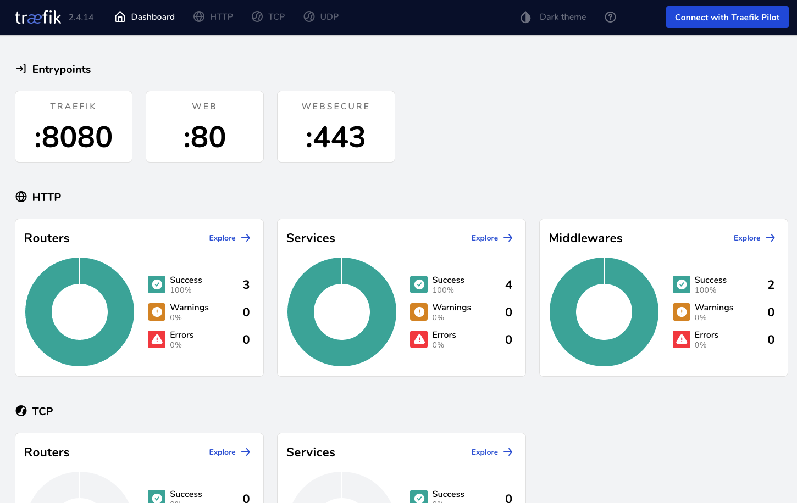
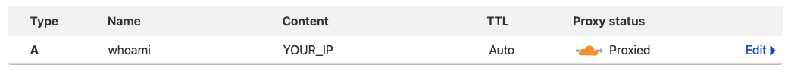
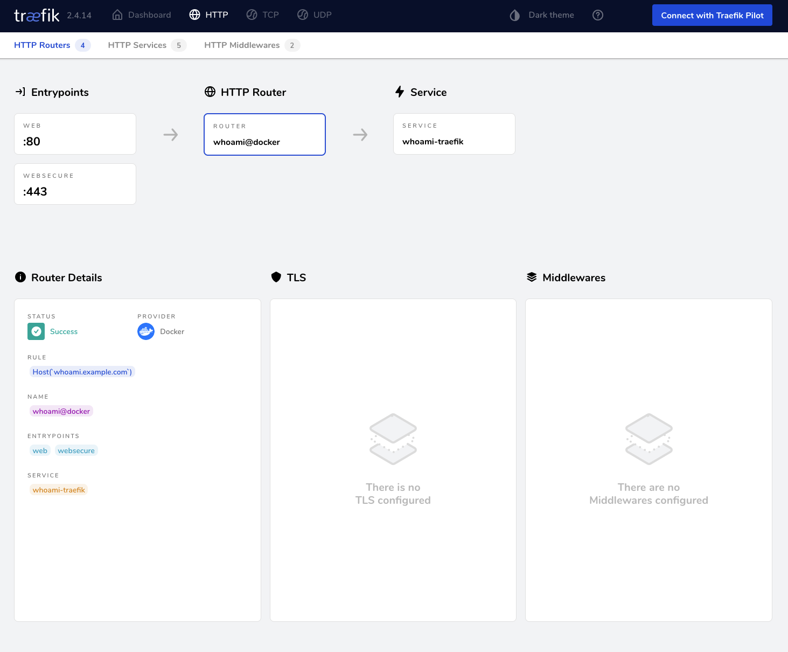
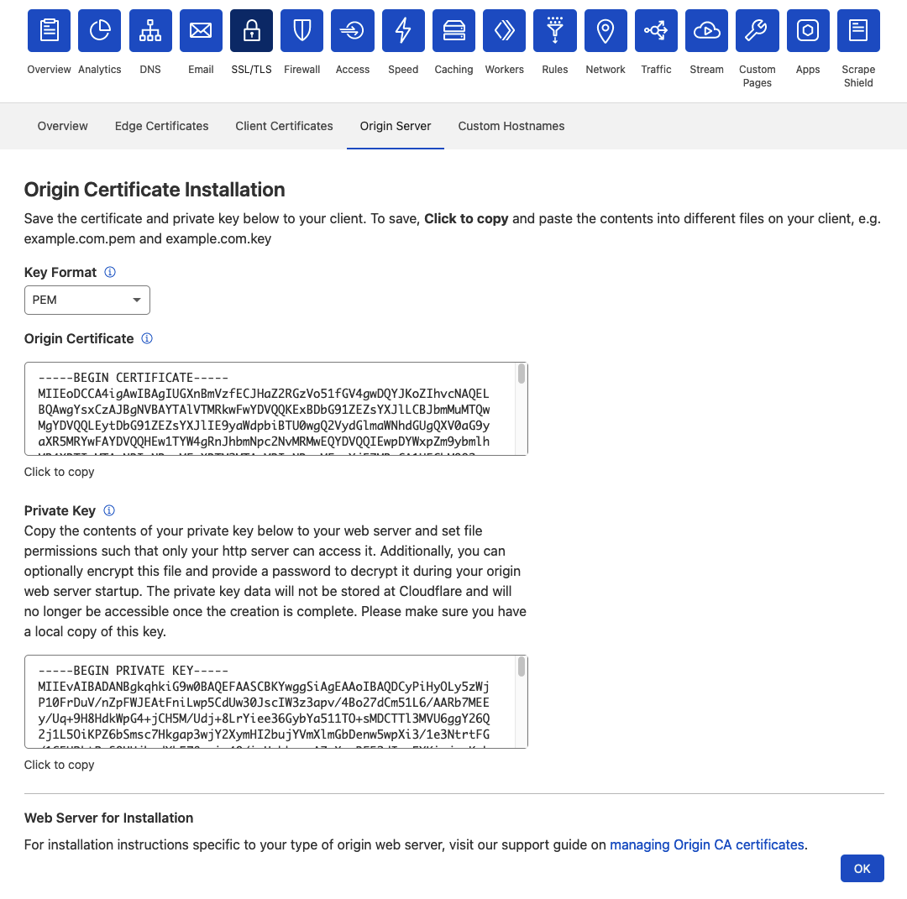
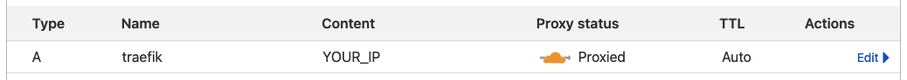

import RefDisclaimer from "../../components/RefDisclaimer.astro";


The following is a guide on how to run infrastructure with multiple applications on a single machine. It's focussed on personal infrastructure and also what I'm using it for, but it definitely can be applied to anything.

## Table of contents

## Introduction

In general we're going to use two main tools: **Traefik** and **Docker** _(and a bit of Cloudflare)_.

Traefik is a reverse proxy and load balancer which calls itself _"The Cloud Native Application Proxy"_. It easily integrates with nearly whatever infrastructure you have already going and configures itself for the most part automatically.

We're going to use Traefik's auto service discovery feature paired with Docker which enables us to start/stop or add/remove services without having to worry about any configuration besides the initial setup.

On top we'll be using Cloudflare as our DNS provider and as a first-level proxy to benefit from their DDoS protection and to hide the origin IP of the server we're going to setup.

## Prerequisites

This guide is based on the fact that you're using or have the following things:

- [Cloudflare](https://cloudflare.com/) account
  - The free plan is more than enough and you'll probably never need to upgrade for a personal setup
- Domain
  - If you don't have a spare one, you can use [TLD List](https://tld-list.com/) and filter based on "cheapest register" to grab a burner domain
  - It should be already added to your Cloudflare account, [guide for adding domains](https://support.cloudflare.com/hc/en-us/articles/201720164-Creating-a-Cloudflare-account-and-adding-a-website)
- Server
  - In this guide I'll be using Ubuntu 20.04 on a CX11 from [Hetzner Cloud](https://hetzner.cloud/?ref=9o3RKIirJ4jI) **(\*)** with 1 vCPU, 2 GB RAM and 20 GB SSD

For simplicity's sake I'll use `example.com` and `SERVER_IP` as placeholders. These should be replaced by your own domain and your server's IP address.

## Building the foundation

### Docker

In this step, we'll install Docker and Docker Compose. If you already have them installed, you can skip this step.

The easiest way to verify if you've got it installed is to check the version of both tools and check if the output is something like the example below.

```bash
$ docker --version

Docker version 20.10.8, build 3967b7d

$ docker-compose --version

docker-compose version 1.25.0, build unknown
```

If you don't have Docker installed, you can refer to the official guides for installing [Docker](https://docs.docker.com/engine/install/ubuntu/) and [Docker Compose](https://docs.docker.com/compose/install/).

### Traefik

The next step is all about getting Traefik installed and running. With Docker already up and running we can directly make use of the [official Docker image of Traefik](https://hub.docker.com/_/traefik).

First step would be to create a dedicated directory, so we're just going to create one in our home directory.

```bash
# Create the main and traefik specific directories in our home directory
$ mkdir ~/infrastructure && mkdir ~/infrastructure/traefik
```

Docker Compose uses so called Compose files which describe how one or multiple Docker containers should be run. We're going to create one and customize it for our Traefik setup.

```bash
# Switch to the traefik directory
$ cd ~/infrastructure/traefik

# Create the Compose file
$ touch docker-compose.yml

# Open with nano or your favorite editor
$ nano docker-compose.yml
```

The following is a basic Compose file to run the Traefik service, open the necessary ports and mount our volumes.

```yaml
# docker-compose.yml

version: "3.3"

services:
  traefik:
    image: traefik:v2.4
    container_name: traefik
    restart: unless-stopped
    ports:
      - "80:80"
      - "443:443"
      - "8080:8080"
    volumes:
      - /var/run/docker.sock:/var/run/docker.sock:ro
      - ./traefik.toml:/etc/traefik/traefik.toml
```

The `version` key refers to the Compose file version. A Docker Compose and Docker compatibility matrix can be found [here](https://docs.docker.com/compose/compose-file/compose-file-v3/).

Followed by the `services` key which represents a list of Docker container we want to run. Each service is a based on a Docker image, in this case the official Traefik image which we pin to version _2.4_. Because we want our reverse proxy to always be available even if it may crash, we define the restart behavior to always restart.

For the ports part we need three different ones. On `80` we're going to serve unencrypted traffic (HTTP) and on `443` encrypted traffic (HTTPS). The `8080` port will be used for the Traefik dashboard itself.

Docker allows to mount files or directories from the host machine to the Docker container. This is useful if the container needs specific files to run properly like configuration, content etc. We're going to mount the `traefik.toml` file from the same directory the `docker-compose.yml` is in to `/etc/traefik/traefik.toml` inside the Docker container which is the default location used by Traefik.

In my introduction I've already teased the auto service discovery feature which filters through all running Docker containers and checks if any of them should be managed by Traefik. In order to do this, we do a little trick and mount the Unix socket of the host machine for Docker inside our container running Traefik. The little `:ro` suffix stands for _read only_ and is a security measure to make sure it only can listen but never write to the host machine. For a deeper explanation see ["Can anyone explain docker.sock"](https://stackoverflow.com/questions/35110146/can-anyone-explain-docker-sock) on Stack Overflow.

Now we're creating our Traefik config file. I'm going to use a `.toml` file but feel free to use a [TOML to YAML converter](https://toolkit.site/format.html).

```bash
# Create the config file
$ touch traefik.toml

# Open with nano or your favorite editor
$ nano traefik.toml
```

```toml
# traefik.toml

################################################################
# Global configuration
################################################################

[global]
  checkNewVersion = true
  # Check for yourself if you want to enable/disable this setting
  sendAnonymousUsage = true

################################################################
# Entrypoints configuration
################################################################

# Enable our two entry points for unencrypted and encrypted traffic
[entryPoints]
  [entryPoints.web]
    address = ":80"

  [entryPoints.websecure]
    address = ":443"

################################################################
# Docker configuration backend
################################################################

# Enable the Docker provider so it will check for Docker containers
[providers]
  [providers.docker]

################################################################
# API and dashboard configuration
################################################################

# This enables the Traefik dashboard, for now it will allow
# unencrypted HTTP traffic from anyone but we'll fix that later
[api]
  insecure = true
  dashboard = true
```

Now it's time to start Traefik for the first time and verify everything is working as intended.

```bash
$ docker-compose up -d

Pulling traefik (traefik:v2.4)...
v2.4: Pulling from library/traefik
ddad3d7c1e96: Pull complete
5f6722e60c2f: Pull complete
3abdcd3bb40c: Pull complete
fe4701c53ae5: Pull complete
Digest: sha256:840e948af3c8d1e45e986eee7d97004ab29cfccffdf0be4c116ba9aaeff5d17a
Status: Downloaded newer image for traefik:v2.4
Creating traefik ... done
Attaching to traefik
traefik    | time="2021-10-05T22:40:13Z" level=info msg="Configuration loaded from file: /etc/traefik/traefik.toml"
```

The output should look similar to the one above, it should pull the Traefik image if it is not yet downloaded, the Container should be started and Traefik should load our configuration file.

Now if you go to `http://SERVER_IP/` in your browser you should be greeted with a _404 page not found_. The same should happen on `https://SERVER_IP/` just with a warning for an invalid certificate which you can ignore for now. Going to `http://SERVER_IP:8080/` should present you with Traefik's dashboard.



**Congratulations!** The basic setup is done.

## Adding the first service

### Subdomain

Now we're going to add the first service to our setup. For testing purposes we'll deploy [Traefik's whoami image](https://hub.docker.com/r/traefik/whoami) which just prints a bunch of information for every request, perfect for debugging and our first dummy service.

Add a new DNS record for the `whoami` subdomain. It should be a type A record which is proxied through Cloudflare to your server.



To verify if it worked we can check the DNS record, you can do this from your machine or your server. But beware, it may take a while for Cloudflare/your system to process the DNS changes!

```bash
$ nslookup whoami.example.com

Non-authoritative answer:
Name:	whoami.example.com
Address: 123.45.67.89
Name:	whoami.example.com
Address: 123.123.34.42
```

Make sure your server's IP is **not** amongst the returned IPs because we're hiding the server behind Cloudflare.

### Network

We don't want our services to be accessible from the internet directly and only through Traefik. Therefore we'll create a Docker network for all our services.

```bash
# Create the network
$ docker network create traefik_proxy
```

This will create the network which still needs to be added to the Compose file.

```diff
 # docker-compose.yml

 version: "3.3"

 services:
   traefik:
     image: traefik:v2.4
     container_name: traefik
     restart: unless-stopped
     ports:
       - "80:80"
       - "443:443"
       - "8080:8080"
     volumes:
       - /var/run/docker.sock:/var/run/docker.sock:ro
       - ./traefik.toml:/etc/traefik/traefik.toml
+    networks:
+      - traefik_proxy
+
+networks:
+  traefik_proxy:
+    external: true
```

And now we can fire Traefik back up.

```bash
# Stop Traefik
$ docker-compose down

# Start Traefik
$ docker-compose up -d
```

### Dummy service

Now we're actually adding the first service by adding the container definition in the compose file.

```diff
 # docker-compose.yml

 version: "3.3"

 services:
   traefik:
     image: traefik:v2.4
     container_name: traefik
     restart: unless-stopped
     ports:
       - "80:80"
       - "443:443"
       - "8080:8080"
     volumes:
       - /var/run/docker.sock:/var/run/docker.sock:ro
       - ./traefik.toml:/etc/traefik/traefik.toml
     networks:
       - traefik_proxy

+  whoami:
+    image: traefik/whoami
+    container_name: whoami
+    restart: unless-stopped
+    labels:
+      - "traefik.enable=true"
+      - "traefik.http.routers.whoami.rule=Host(`whoami.example.com`)"
+    networks:
+      - traefik_proxy

 networks:
   traefik_proxy:
     external: true
```

This adds a second Docker container called `whoami` which is also in the `traefik_proxy` network.

The important part here are the labels of the container. These will be read by Traefik and describe how it should be configured.

Adding a Docker container to Traefik can be achieved by giving it the `traefik.enable=true` label. But each container will need conditions on when Traefik should route the traffic to it. In this case we create a router called `whoami` and add the condition that only traffic with the a `Host: whoami.example.com` header should be routed to this container.

This is the magic of the auto service discovery by Traefik, for the most part you only need to add a few labels to your Docker containers to manage the behavior of Traefik without ever restarting it.

Now you can both Traefik and the whoami container.

```bash
$ docker-compose up -d
```

Verify that the service is reachable by going to `http://whoami.example.com` and `https://whoami.example.com`.

You should now also see the HTTP router and service by going inside Traefik's dashboard -> HTTP -> HTTP Routers -> `whoami@docker`.



Now our service is reachable by the Internet but only through Cloudflare and Traefik. The next steps will all be about security for the setup.

## Securing the setup

This is probably the harder part of the this guide but I definitely recommended it when running this setup on a public server.

### Encrypted Cloudflare tunnel

Currently only the HTTPS traffic from your users to Cloudflare is encrypted but the proxied traffic from Cloudflare to your server is unencrypted. If you prefer to have it encrypted, follow this chapter, otherwise you can skip ahead.

The first step is to switch the SSL/TLS encryption mode in the Cloudflare dashboard. The default should be **Flexible** which just encrypts traffic between the users and Cloudflare. We want to switch to **Full (strict)** which also encrypts the traffic between Cloudflare and your server but on top requires a special certificate by Cloudflare on your server.

Creating an origin certificate can also be done via the Dashboard under the _SSL/TLS_ tab. Make sure to include at least `example.com` and `*.example.com` as hostnames for the certificate. The duration is up to your preference, I'll always go with the longest duration so I'll never run into the issue of an expired certificate. But you should know that it's possible to revoke your certificates via Cloudflare in case they are compromised.


After creating the certificate you'll see the certificate and it's private key. Make sure the key format is set to **PEM**!



First we'll create a dedicated directory on our server and then copy the certificate and private key over to our server.

```bash
# Create a directory for certificate related files
$ mkdir ~/infrastructure/traefik/certs

# Switch to the newly created directory
$ cd ~/infrastructure/traefik/certs

# Create the files in which we'll paste the data from Cloudflare
$ touch cloudflare.cert && touch cloudflare.key

# Open the cloudflare.cert file with nano or your favorite editor
# and paste in the PEM origin certificate
$ nano cloudflare.cert

# Open the cloudflare.key file
# and paste in the private key
$ nano cloudflare.key
```

Now we're ready to make our Traefik setup aware of the new certificate.

Make sure everything is stopped and start editing the `docker-compose.yml`.

```bash
# Stop Traefik
$ docker-compose down

# Edit the docker-compose.yml
$ nano docker-compose.yml
```

We'll mount our `certs/` directory containing the certificate and key by Cloudflare to the Traefik container.

```diff
 # docker-compose.yml

 version: "3.3"

 services:
   traefik:
     image: traefik:v2.4
     container_name: traefik
     restart: unless-stopped
     ports:
       - "80:80"
       - "443:443"
       - "8080:8080"
     volumes:
       - /var/run/docker.sock:/var/run/docker.sock:ro
       - ./traefik.toml:/etc/traefik/traefik.toml
+      - ./certs/:/etc/traefik/certs/
     networks:
       - traefik_proxy

   whoami:
     image: traefik/whoami
     container_name: whoami
     restart: unless-stopped
     labels:
       - "traefik.enable=true"
       - "traefik.http.routers.whoami.rule=Host(`whoami.example.com`)"
     networks:
       - traefik_proxy

 networks:
   traefik_proxy:
     external: true
```

Now Traefik technically has access to the certificate but can't make use of it until we explicitly tell it to use it. That's done via a dynamic config.

Traefik differentiates between [_static_ and _dynamic_ config files](https://doc.traefik.io/traefik/v2.0/getting-started/configuration-overview/). The static config defines everything which Traefik needs at startup time e.g. entry points. On the other hand the dynamic config includes everything from routers, services, middlewares and also in our case: certificates.

Because our current config file `traefik.toml` is a static one, we need to add a second dynamic one called `traefik.dyn.toml`.

```toml
# traefik.dyn.toml

################################################################
# SSL Certs
################################################################

[tls.stores]
  [tls.stores.default]
    [tls.stores.default.defaultCertificate]
      certFile = "/etc/traefik/certs/cloudflare.cert"
      keyFile = "/etc/traefik/certs/cloudflare.key"
```

The configuration is relatively simple, we just set our certificate and it's key as the default.

Now we just need to reference the dynamic config in the already existing static one by adding this line to the `[providers]` block:

```toml
# traefik.toml

[...]

################################################################
# Docker configuration backend
################################################################

# Enable the Docker provider so it will check for Docker containers
[providers]
  [providers.docker]

  [providers.file]
    filename = "/etc/traefik/traefik.dyn.toml"

[...]
```

Additionally we need to mount the new config file into Traefik's docker container and also enable TLS for our dummy `whoami` container.

```diff
 # docker-compose.yml

 version: "3.3"

 services:
   traefik:
     image: traefik:v2.4
     container_name: traefik
     restart: unless-stopped
     ports:
       - "80:80"
       - "443:443"
       - "8080:8080"
     volumes:
       - /var/run/docker.sock:/var/run/docker.sock:ro
       - ./traefik.toml:/etc/traefik/traefik.toml
       - ./certs/:/etc/traefik/certs/
+      - ./traefik.dyn.toml:/etc/traefik/traefik.dyn.toml
     networks:
       - traefik_proxy

   whoami:
     image: traefik/whoami
     container_name: whoami
     restart: unless-stopped
     labels:
       - "traefik.enable=true"
       - "traefik.http.routers.whoami.rule=Host(`whoami.example.com`)"
+      - "traefik.http.routers.whoami.tls=true"
     networks:
       - traefik_proxy

 networks:
   traefik_proxy:
     external: true
```

And the obligatory restart:

```bash
# Stop Traefik + Whoami
$ docker-compose down

# Start Traefik + Whoami
$ docker-compose up -d
```

Each request to `whoami.example.com` now will not only pass through Cloudflare's servers as a proxy but it will now also be encrypted between the browser and Cloudflare as well as between Cloudflare and our server.

### Disable HTTP

In times of [Let's Encrypt](https://letsencrypt.org/) where simple SSL certificates don't cost a fortune anymore there's no real reason to service HTTP traffic anymore.

This step is pretty easy as we only need to remove the `web` entrypoint from Traefik and stop exposing port `80` in our Docker container.

```diff
# traefik.toml

[...]

################################################################
# Entrypoints configuration
################################################################

[entryPoints]
- [entryPoints.web]
-   address = ":80"

  [entryPoints.websecure]
    address = ":443"

[...]
```

```diff
 # docker-compose.yml

 version: "3.3"

 services:
   traefik:
     image: traefik:v2.4
     container_name: traefik
     restart: unless-stopped
     ports:
-      - "80:80"
       - "443:443"
       - "8080:8080"
     volumes:
       - /var/run/docker.sock:/var/run/docker.sock:ro
       - ./traefik.toml:/etc/traefik/traefik.toml
       - ./certs/:/etc/traefik/certs/
       - ./traefik.dyn.toml:/etc/traefik/traefik.dyn.toml
     networks:
       - traefik_proxy

   whoami:
     image: traefik/whoami
     container_name: whoami
     restart: unless-stopped
     labels:
       - "traefik.enable=true"
       - "traefik.http.routers.whoami.rule=Host(`whoami.example.com`)"
       - "traefik.http.routers.whoami.tls=true"
     networks:
       - traefik_proxy

 networks:
   traefik_proxy:
     external: true
```

Restarting everything will disable HTTP traffic.

### Route Traefik dashboard through Cloudflare

It's a bit ugly in the long run to always go to `https://SERVER_IP:8080` if you want to check out your Traefik's dashboard.

As a first step we'll need to add another DNS record to Cloudflare to point to our server. Give it a name of your choice, in my case I went with `traefik` and make sure it's getting proxied through Cloudflare.



Instead of **publishing** port `8080` like we're doing right now, we're just going to **expose** it internally. The difference between publishing and exposing can be read [here](https://stackoverflow.com/questions/40801772/what-is-the-difference-between-docker-compose-ports-vs-expose), but summarized: using `ports` in the `docker-compose.yml` will publish the port to the host machine and using `expose` makes them only available internally in the attached networks.

We rather want to make Traefik available by using Traefik itself instead of relaying on ports. We do it pretty easily by still exposing the dashboard on the `8080` internally port but using Traefik itself to route it via a `Hostname` match rule.

```diff
 # docker-compose.yml

 version: "3.3"

 services:
   traefik:
     image: traefik:v2.4
     container_name: traefik
     restart: unless-stopped
     ports:
       - "443:443"
-      - "8080:8080"
+    expose:
+      - 8080
     volumes:
       - /var/run/docker.sock:/var/run/docker.sock:ro
       - ./traefik.toml:/etc/traefik/traefik.toml
       - ./certs/:/etc/traefik/certs/
       - ./traefik.dyn.toml:/etc/traefik/traefik.dyn.toml
+    labels:
+      - "traefik.enable=true"
+      - "traefik.http.routers.traefik.rule=Host(`traefik.example.com`)"
+      - "traefik.http.routers.traefik.tls=true"
+      - "traefik.http.services.traefik.loadbalancer.server.port=8080"
     networks:
       - traefik_proxy

   whoami:
     image: traefik/whoami
     container_name: whoami
     restart: unless-stopped
     labels:
       - "traefik.enable=true"
       - "traefik.http.routers.whoami.rule=Host(`whoami.example.com`)"
       - "traefik.http.routers.whoami.tls=true"
     networks:
       - traefik_proxy

 networks:
   traefik_proxy:
     external: true
```

### Add basic auth

Another simple way of keeping people out is by using the basic HTTP authentication. In this case it does make a lot of sense to either fully disable the dashboard or at least put it behind a password.

Adding basic auth to a service is done by attaching a middleware with at least one valid user and applying this middleware to the router of the service.

You can either hash the passwords yourself ([MD5, SHA1 or BCrypt](https://doc.traefik.io/traefik/middlewares/http/basicauth/#general)), use the [`htpasswd`](https://httpd.apache.org/docs/2.4/programs/htpasswd.html) tool or use an [online generator](https://www.web2generators.com/apache-tools/htpasswd-generator).

I'm going to go for `foo` as the user and `bar` as the password which results in: `foo:$apr1$4k9xslna$gWEwvM/Af0uA8Xdvz2u7X0`. Make sure you escape all `$` by doubling them: `foo:$$apr1$$4k9xslna$$gWEwvM/Af0uA8Xdvz2u7X0`.

```diff
 # docker-compose.yml

 version: "3.3"

 services:
   traefik:
     image: traefik:v2.4
     container_name: traefik
     restart: unless-stopped
     ports:
       - "443:443"
       - "8080:8080"
     expose:
       - 8080
     volumes:
       - /var/run/docker.sock:/var/run/docker.sock:ro
       - ./traefik.toml:/etc/traefik/traefik.toml
       - ./certs/:/etc/traefik/certs/
       - ./traefik.dyn.toml:/etc/traefik/traefik.dyn.toml
     labels:
       - "traefik.enable=true"
       - "traefik.http.routers.traefik.rule=Host(`traefik.example.com`)"
       - "traefik.http.routers.traefik.tls=true"
       - "traefik.http.services.traefik.loadbalancer.server.port=8080"
+      - "traefik.http.middlewares.traefik.basicauth.users=foo:$$apr1$$4k9xslna$$gWEwvM/Af0uA8Xdvz2u7X0"
+      - "traefik.http.routers.traefik.middlewares=traefik@docker"
     networks:
       - traefik_proxy

   whoami:
     image: traefik/whoami
     container_name: whoami
     restart: unless-stopped
     labels:
       - "traefik.enable=true"
       - "traefik.http.routers.whoami.rule=Host(`whoami.example.com`)"
       - "traefik.http.routers.whoami.tls=true"
     networks:
       - traefik_proxy

 networks:
   traefik_proxy:
     external: true
```

I've called the middleware `traefik` because it's the container's name it's being attached to, make sure you change it accordingly. By the way: it's `traefik@docker` because the middleware is being defined in the `docker-compose.yml`, if you would define it e.g. in a TOML config for Traefik it would be called `traefik@file`.

You should definitely add basic auth to the dashboard (aka Traefik docker container) or disable it entirely via the `traefik.toml` file.

### Whitelist Cloudflare IPs

Our outgoing traffic will be validated by Cloudflare checking for the specific origin SSL certificate only they and our server now but we can also make sure incoming traffic is from Cloudflare by whitelisting their IP ranges.

Cloudflare [publishes their IP ranges](https://www.cloudflare.com/ips/) publicly which makes it pretty easy for us, but I do want to point it: these ranges can and will change at some point. They only had three changes since 2017 but they do indeed happen, so make sure you have an alert ready and/or are subscribed to Cloudflare's updates via email.

Whitelisting IP ranges is pretty easy with Traefik. We need to create a `ipWhiteList` middleware which we're going to do in our dynamic Traefik config file. We do it in the file instead of as a Docker label because it's just easier to use for multiple services.

```toml
 # traefik.dyn.toml

 [...]

 ################################################################
 # Middlewares
 ################################################################

 [http.middlewares]
   [http.middlewares.cloudflare.ipWhiteList]
     sourceRange = ["103.21.244.0/22", "103.22.200.0/22", "103.31.4.0/22", "104.16.0.0/13", "104.24.0.0/14", "108.162.192.0/18", "131.0.72.0/22", "141.101.64.0/18", "162.158.0.0/15", "172.64.0.0/13", "173.245.48.0/20", "188.114.96.0/20", "190.93.240.0/20", "197.234.240.0/22", "198.41.128.0/17", "2400:cb00::/32", "2606:4700::/32", "2803:f800::/32", "2405:b500::/32", "2405:8100::/32", "2a06:98c0::/29", "2c0f:f248::/32"]

 [...]
```

Now we just need to attach the middleware to all the routers of the services we want to make sure only receive traffic proxied by Cloudflare.

```diff
 # docker-compose.yml

 version: "3.3"

 services:
   traefik:
     image: traefik:v2.4
     container_name: traefik
     restart: unless-stopped
     ports:
       - "443:443"
       - "8080:8080"
     expose:
       - 8080
     volumes:
       - /var/run/docker.sock:/var/run/docker.sock:ro
       - ./traefik.toml:/etc/traefik/traefik.toml
       - ./certs/:/etc/traefik/certs/
       - ./traefik.dyn.toml:/etc/traefik/traefik.dyn.toml
     labels:
       - "traefik.enable=true"
       - "traefik.http.routers.traefik.rule=Host(`traefik.example.com`)"
       - "traefik.http.routers.traefik.tls=true"
       - "traefik.http.services.traefik.loadbalancer.server.port=8080"
       - "traefik.http.middlewares.traefik.basicauth.users=foo:$$apr1$$4k9xslna$$gWEwvM/Af0uA8Xdvz2u7X0"
       - "traefik.http.routers.traefik.middlewares=traefik@docker"
     networks:
       - traefik_proxy

   whoami:
     image: traefik/whoami
     container_name: whoami
     restart: unless-stopped
     labels:
       - "traefik.enable=true"
       - "traefik.http.routers.whoami.rule=Host(`whoami.example.com`)"
       - "traefik.http.routers.whoami.tls=true"
+      - "traefik.http.routers.whoami.middlewares=cloudflare@file"
     networks:
       - traefik_proxy

 networks:
   traefik_proxy:
     external: true
```

<RefDisclaimer />
